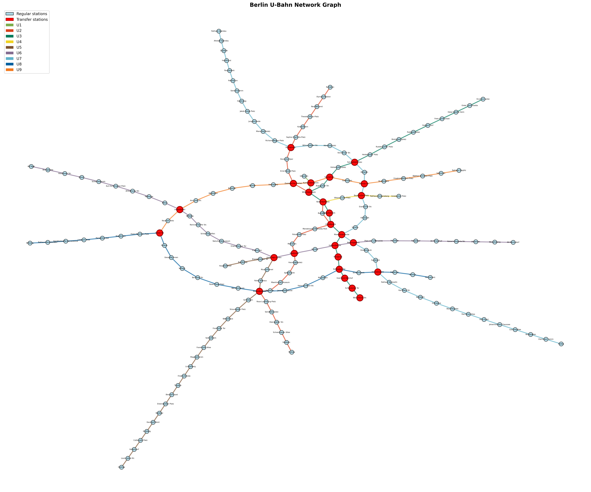

# goit-algo-hw-06

##  Task 1 - Аналіз мережі метро Берліна (U-Bahn)

Цей проект містить аналіз та візуалізацію мережі метро Берліна у вигляді графа, де станції представлені вершинами, а з'єднання між станціями - ребрами.

### Візуалізація графа



На графіку:
- **Сині вузли** - звичайні станції
- **Червоні вузли** - пересадкові станції (з'єднують кілька ліній метро)
- **Кольорові ребра** - лінії метро з їх оригінальними кольорами (U1-U9)

### Аналіз характеристик графа

#### 1. Основні параметри

- **Кількість вершин (станцій):** 175
- **Кількість ребер (з'єднань):** 188

#### 2. Ступінь вершин (потужність вершин)

- **Середній ступінь:** 2.15
- **Максимальний ступінь:** 6
- **Мінімальний ступінь:** 1

#### 3. Найважливіші пересадкові станції

Станції з найбільшою кількістю з'єднань:

1. **Alexanderplatz** - ступінь 6, з'єднує 3 лінії (U2, U5, U8)
2. **Nollendorfplatz** - ступінь 4, з'єднує 4 лінії (U1, U2, U3, U4)
3. **Kottbusser Tor** - ступінь 4, з'єднує 3 лінії (U1, U3, U8)
4. **Hallesches Tor** - ступінь 4, з'єднує 3 лінії (U1, U3, U6)
5. **Moeckernbruecke** - ступінь 4, з'єднує 3 лінії (U1, U3, U7)
6. **Gleisdreieck** - ступінь 4, з'єднує 3 лінії (U1, U2, U3)
7. **Wittenbergplatz** - ступінь 4, з'єднує 3 лінії (U1, U2, U3)

**Загальна кількість пересадкових станцій:** 25

#### 4. Додаткові характеристики графа

- **Зв'язність графа:** Так (всі станції досяжні одна з одної)
- **Діаметр графа:** 46 (найдовший найкоротший шлях між двома станціями)
- **Середня довжина шляху:** 14.27 станцій
- **Щільність графа:** 0.0123 (відносно розріджена мережа)

### Лінії метро

Мережа складається з 9 ліній U-Bahn:

- **U1**  - Зелена лінія
- **U2**  - Червона лінія
- **U3**  - Бірюзова лінія
- **U4**  - Жовта лінія
- **U5**  - Коричнева лінія
- **U6**  - Фіолетова лінія
- **U7**  - Блакитна лінія
- **U8**  - Синя лінія
- **U9**  - Помаранчева лінія

### Висновки

1. **Alexanderplatz** є найважливішим транспортним вузлом з найбільшою кількістю з'єднань (ступінь = 6)
2. Мережа повністю зв'язана, що означає можливість дістатися з будь-якої станції до будь-якої іншої
3. Середня відстань між станціями становить ~14 станцій, що свідчить про розгалужену структуру мережі
4. Наявність 25 пересадкових станцій забезпечує гнучкість маршрутів та зручність пересадок


## Task 2: Порівняння алгоритмів пошуку шляхів (DFS vs BFS)

У цьому завданні реалізовано та порівняно два класичні алгоритми пошуку шляхів у графі:
- **DFS (Depth-First Search)** - пошук у глибину
- **BFS (Breadth-First Search)** - пошук у ширину

### Опис алгоритмів

#### DFS (Depth-First Search) - Пошук у глибину
- Досліджує граф якомога глибше перед поверненням назад
- Використовує стек (LIFO - Last In, First Out)
- **НЕ гарантує** найкоротший шлях
- Ефективний з точки зору пам'яті для глибоких графів
- Добре підходить для: дослідження всіх можливостей, вирішення лабіринтів

#### BFS (Breadth-First Search) - Пошук у ширину
- Досліджує всіх сусідів на поточному рівні перед переходом до наступного
- Використовує чергу (FIFO - First In, First Out)
- **Гарантує найкоротший шлях** у незважених графах
- Більш ресурсомісткий для широких графів
- Добре підходить для: пошуку найкоротших шляхів, обходу по рівнях

### Результати тестування

Алгоритми були протестовані на 5 різних маршрутах мережі метро Берліна:

#### 1. Alexanderplatz → Zoologischer Garten
- **DFS шлях:** 20 станцій
- **BFS шлях:** 13 станцій (найкоротший)
- **Різниця:** 7 станцій
- **Ефективність BFS:** 53.8% краще

**DFS маршрут:**
```
Alexanderplatz → Klosterstr. → Maerkisches Museum → Spittelmarkt → 
Hausvogteiplatz → Stadtmitte → Mohrenstr. → Potsdamer Platz → 
Mendelssohn-Bartholdy-Park → Gleisdreieck → Moeckernbruecke → Yorckstr. → 
Kleistpark → Eisenacher Str. → Bayerischer Platz → Viktoria-Luise-Platz → 
Nollendorfplatz → Wittenbergplatz → Kurfuerstendamm → Zoologischer Garten
```

**BFS маршрут:**
```
Alexanderplatz → Rotes Rathaus → Museumsinsel → Unter den Linden → 
Stadtmitte → Mohrenstr. → Potsdamer Platz → Mendelssohn-Bartholdy-Park → 
Gleisdreieck → Kurfuerstenstr. → Nollendorfplatz → Wittenbergplatz → 
Zoologischer Garten
```

#### 2. Warschauer Str. → Rathaus Spandau
- **DFS шлях:** 28 станцій
- **BFS шлях:** 27 станцій (найкоротший)
- **Різниця:** 1 станція
- **Ефективність BFS:** 3.7% краще

#### 3. Nollendorfplatz → Hauptbahnhof
- **DFS шлях:** 20 станцій
- **BFS шлях:** 11 станцій (найкоротший)
- **Різниця:** 9 станцій
- **Ефективність BFS:** 81.8% краще

#### 4. Uhlandstr. → Hoenow
- **DFS шлях:** 33 станції
- **BFS шлях:** 33 станції (найкоротший)
- **Різниця:** 0 станцій
- ✓ Обидва алгоритми знайшли однаковий шлях

#### 5. Pankow → Rudow
- **DFS шлях:** 34 станції
- **BFS шлях:** 25 станцій (найкоротший)
- **Різниця:** 9 станцій
- **Ефективність BFS:** 36.0% краще

### Підсумкова таблиця результатів

| Маршрут | DFS | BFS | Різниця | Статус |
|---------|-----|-----|---------|--------|
| Alexanderplatz → Zoologischer Garten | 20 | 13 | +7 | BFS ефективніше |
| Warschauer Str. → Rathaus Spandau | 28 | 27 | +1 | BFS ефективніше |
| Nollendorfplatz → Hauptbahnhof | 20 | 11 | +9 | BFS ефективніше |
| Uhlandstr. → Hoenow | 33 | 33 | 0 | Однаковий результат |
| Pankow → Rudow | 34 | 25 | +9 | BFS ефективніше |

**Середня різниця:** 5.2 станції

### Висновки Task 2

1. **BFS завжди знаходить найкоротший шлях** у незважених графах, як мережа метро
2. **BFS виявився ефективнішим** у 4 з 5 тестових випадків
3. **Середня перевага BFS** становить 5.2 станції, що може суттєво заощадити час подорожі
4. **DFS може знайти значно довший шлях** (до 81.8% більше станцій у найгіршому випадку)
5. **Для навігації в метро рекомендується BFS**, оскільки він гарантує найкоротший маршрут

### Практичне застосування

- **BFS** - ідеальний вибір для систем навігації та GPS, де потрібен найкоротший шлях
- **DFS** - корисний для аналізу зв'язності мережі, пошуку всіх можливих маршрутів


---

## Task 3: Алгоритм Дейкстри для зваженого графа

У цьому завданні реалізовано алгоритм Дейкстри (Dijkstra) для пошуку найкоротшого шляху у зваженому графі. До всіх ребер графа додано випадкові ваги в діапазоні від 2.0 до 3.0 одиниць, що імітують час або відстань подорожі між станціями.

### Опис алгоритму Дейкстри

**Алгоритм Дейкстри** - це класичний алгоритм пошуку найкоротшого шляху у зваженому графі з невід'ємними вагами ребер.

**Принцип роботи:**
- Завжди досліджує вершину з найменшою відомою відстанню від початкової точки
- Гарантує оптимальне рішення для графів з невід'ємними вагами ребер
- Використовує пріоритетну чергу для ефективного вибору наступної вершини
- Часова складність: O((V + E) log V) з використанням бінарної купи

**Відмінності від BFS:**
- BFS знаходить найкоротший шлях за кількістю ребер (незважений граф)
- Дейкстра знаходить найкоротший шлях за сумою ваг ребер (зважений граф)
- Дейкстра враховує "вартість" кожного переходу між вершинами

### Тестовий маршрут

**Початкова станція:** Viktoria-Luise-Platz  
**Кінцева станція:** Weberwiese

### Результати виконання

#### Параметри графа
- **Загальна кількість станцій:** 175
- **Загальна кількість з'єднань:** 188
- **Діапазон ваг ребер:** 2.0 - 3.0 одиниць (випадково згенеровані)

#### Приклади ваг ребер
1. Warschauer Str. ↔ Schlesisches Tor: **2.64** одиниці
2. Schlesisches Tor ↔ Goerlitzer Bahnhof: **2.03** одиниці
3. Goerlitzer Bahnhof ↔ Kottbusser Tor: **2.28** одиниці
4. Kottbusser Tor ↔ Prinzenstr.: **2.22** одиниці
5. Kottbusser Tor ↔ Moritzplatz: **2.74** одиниці

#### Найкоротший шлях за алгоритмом Дейкстри

**Загальна відстань:** 32.80 одиниць  
**Кількість станцій:** 15  
**Кількість сегментів:** 14

**Маршрут:**
```
Viktoria-Luise-Platz → Nollendorfplatz → Kurfuerstenstr. → Gleisdreieck → 
Mendelssohn-Bartholdy-Park → Potsdamer Platz → Mohrenstr. → Stadtmitte → 
Unter den Linden → Museumsinsel → Rotes Rathaus → Alexanderplatz → 
Schillingstr. → Strausberger Platz → Weberwiese
```

#### Детальна розбивка по сегментах

| № | Від | До | Вага |
|---|-----|-----|------|
| 1 | Viktoria-Luise-Platz | Nollendorfplatz | 2.01 |
| 2 | Nollendorfplatz | Kurfuerstenstr. | 2.22 |
| 3 | Kurfuerstenstr. | Gleisdreieck | 2.20 |
| 4 | Gleisdreieck | Mendelssohn-Bartholdy-Park | 2.65 |
| 5 | Mendelssohn-Bartholdy-Park | Potsdamer Platz | 2.23 |
| 6 | Potsdamer Platz | Mohrenstr. | 2.08 |
| 7 | Mohrenstr. | Stadtmitte | 2.05 |
| 8 | Stadtmitte | Unter den Linden | 2.23 |
| 9 | Unter den Linden | Museumsinsel | 2.26 |
| 10 | Museumsinsel | Rotes Rathaus | 2.90 |
| 11 | Rotes Rathaus | Alexanderplatz | 2.97 |
| 12 | Alexanderplatz | Schillingstr. | 2.38 |
| 13 | Schillingstr. | Strausberger Platz | 2.40 |
| 14 | Strausberger Platz | Weberwiese | 2.22 |

**ЗАГАЛЬНА ВІДСТАНЬ: 32.80 одиниць**

### Порівняння: Дейкстра vs BFS

#### BFS (незважений найкоротший шлях)
- **Кількість станцій:** 15
- **Зважена відстань:** 32.95 одиниць
- **Маршрут:** Viktoria-Luise-Platz → Nollendorfplatz → Kurfuerstenstr. → Gleisdreieck → Moeckernbruecke → Hallesches Tor → Prinzenstr. → Kottbusser Tor → Moritzplatz → Heinrich-Heine-Str. → Jannowitzbruecke → Alexanderplatz → Schillingstr. → Strausberger Platz → Weberwiese

#### Дейкстра (зважений найкоротший шлях)
- **Зважена відстань:** 32.80 одиниць

#### Аналіз результатів
- ✅ Дейкстра знайшов шлях на **0.15 одиниць коротший** (0.5% краще)
- ✅ Обидва алгоритми знайшли шляхи з однаковою кількістю станцій (15)
- ✅ Однак маршрути відрізняються: Дейкстра обрав інший шлях через Mohrenstr. та Unter den Linden замість Moeckernbruecke та Kottbusser Tor
- ✅ Це демонструє важливість врахування ваг ребер при пошуку оптимального маршруту!

### Висновки Task 3

1. **Алгоритм Дейкстри гарантує найкоротший шлях** у зважених графах з невід'ємними вагами
2. **Врахування ваг ребер критично важливе** - навіть при однаковій кількості станцій, різні маршрути можуть мати різну загальну "вартість"
3. **Покращення на 0.5%** може здатися незначним, але у великих мережах або при високій вартості переходів це може бути суттєвим
4. **Практичне застосування:** навігаційні системи, оптимізація транспортних маршрутів, мережеве маршрутування
5. **BFS достатньо, коли всі переходи мають однакову вартість**, але для реальних систем з різними часами/відстанями необхідний Дейкстра


